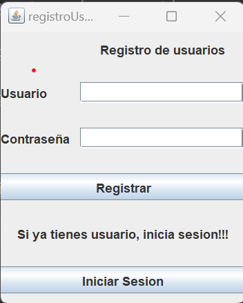
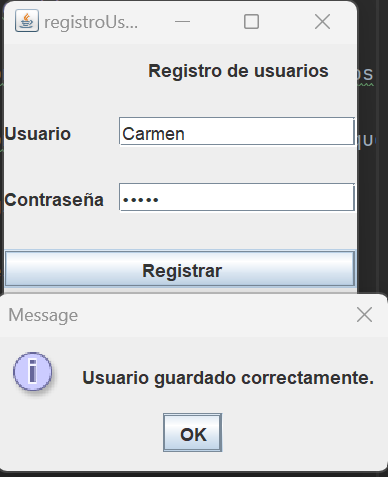
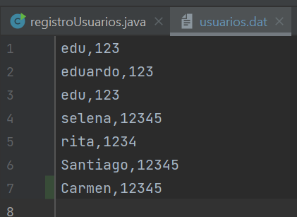
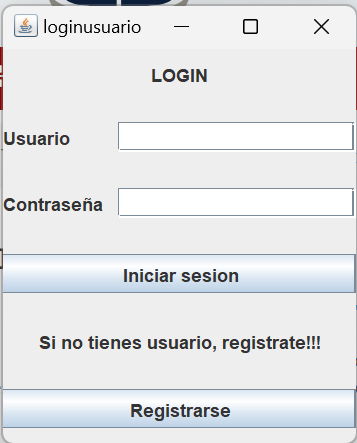
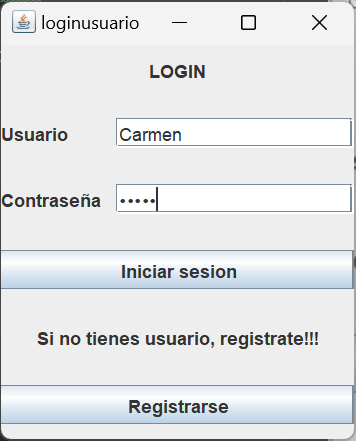
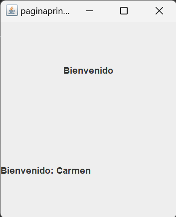

# LoginJAVA
## Autor: Eduardo Almachi
### Deber componentes swingx y archivos
Instruccion: 
- 1.- Implementar una aplicación que permita ingresar usuarios y los guarde en un archivo "usuarios.dat"

- 2.- Implementar una aplicación que tenga un form de login que nos redireccione a un segundo form donde se mostrará el nombre del usuario. El login y password deben ser validados desde un archivo binary "usuarios.dat" donde existan 5 usuarios con sus claves respectivas.

- Entregables: Repositorio de github con readme detallado.

- Pueden trabajar grupos de tres.
---

