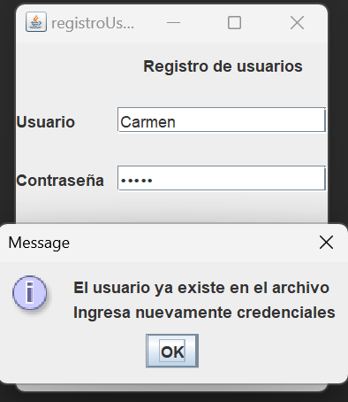

# LoginJAVA
## Autor: Eduardo Almachi
### Deber componentes swingx y archivos
Instruccion: 
- 1.- Implementar una aplicación que permita ingresar usuarios y los guarde en un archivo "usuarios.dat"

- 2.- Implementar una aplicación que tenga un form de login que nos redireccione a un segundo form donde se mostrará el nombre del usuario. El login y password deben ser validados desde un archivo binary "usuarios.dat" donde existan 5 usuarios con sus claves respectivas.

- Entregables: Repositorio de github con readme detallado.

- Pueden trabajar grupos de tres.
---
La funcionalidad de esta aplicacion consiste en el inicio que es esta parte
de el registro de usuarios, es una interfaz intuitiva para ingreso de usuario 
y contraseña ademas de un boton de para registrarse y otro 
si fuera el caso par que se dirija a inicar sesion.

Si ingresamos nuestro usuario y y contraseña al dar en el boton registrar nos aparecera
esa notificacion de que se a podido ingresar correctamente el usuario.

Una vez registrado se guarda en el archivo usuarios.dat el usuario y la contraseña.

Y en el caso que el usuario ya exista en la base sale un mensaje que ingrese nuevamente las credenciales a registrar.

Ahora si damos al boton inicio de sesion nos dirige hacia esta parte en la cual
se presenta la interfaz de inicio de sesion, esta es similar pero sirve solo 
para inicio de sesion.

